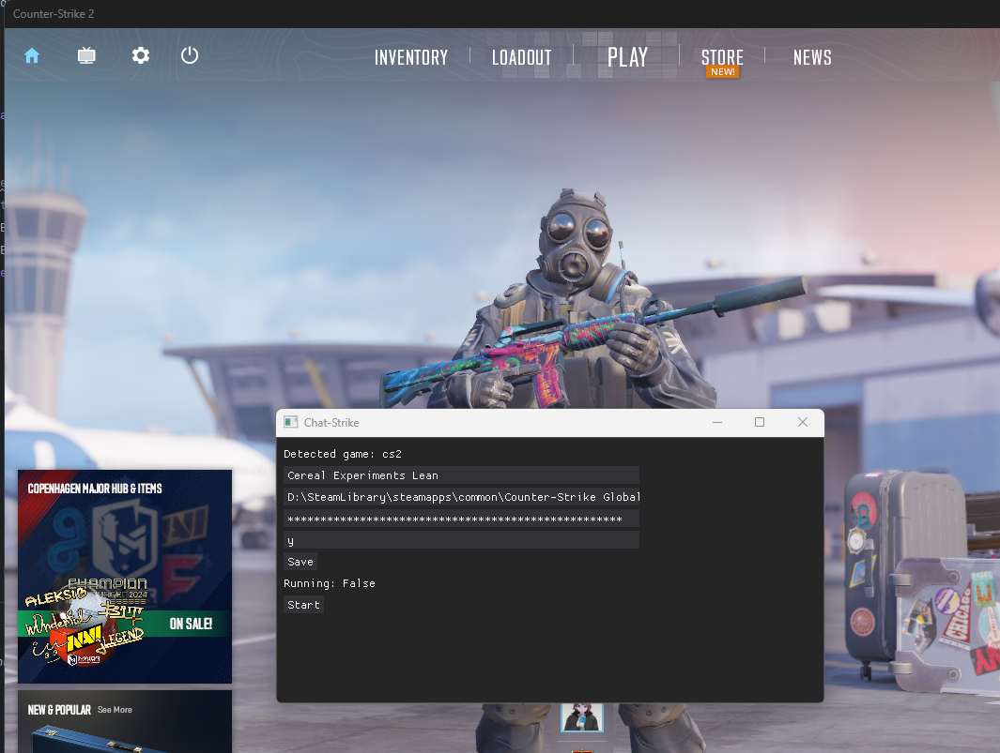

# chat-strike

Inspired by Isaac Duarte's https://github.com/Isaac-Duarte/source_cmd_parser this script integrates chat-gpt into Counter-Strike 2 (Or any GldSource, Source/2 game) allowing people in the same server to interact with it.

## Requirements

- 64bit Windows
- Python 3.11+ < 3.12

It is highly recommended that you possess an openai-api key, but it is not necessary unless you're attempting to use `/chat.py`

## Usage

First, you must enable console logging, to achieve this you can do one of the following:

+ For CS:S type the following into the in-game developer console: ``con_logfile <filename>; con_timestamp 1`` (you must do this each time you open the game)

+ For CS2 or HL add `-condebug` to your game's launch options on Steam.

If you used the latter option your path probably looks something like this: ``C:\Program Files\SteamLibrary\steamapps\common\Counter-Strike Global Offensive\game\csgo\console.log``

+ Open `config.ini` and set `gameconlogpath` to the appropriate path, there you will also set your in-game username and your openai api key.

Now you can do `python chat.py`


### Example

```python
import conparser as cp

game = cp.detect_game()

with open(cp.CON_LOG_FILE_PATH, encoding='utf-8') as logfile:
        logfile.seek(0, 2)  # Point cursor to the end of console.log to retrieve latest line
        while True:
            line = cp.rt_file_read(logfile)
            if not line:
                continue
            print(cp.parse_log(game, line)) # Print each new line in console log file to terminal
```


## How it works

Very similar to Isaac's framework this script reads the console log file. New entries are parsed and sent to chat-gpt to generate a response which is then sent back in game chat through simulated keystrokes.

This module does not work on Linux ***yet***.


